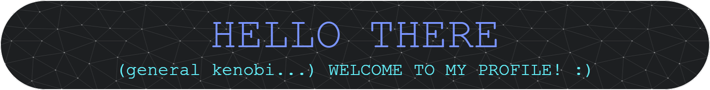

<!--
**aeris170/aeris170** is a ✨ _special_ ✨ repository because its `README.md` (this file) appears on your GitHub profile.

Here are some ideas to get you started:

- 🔭 I’m currently working on ...
- 🌱 I’m currently learning ...
- 👯 I’m looking to collaborate on ...
- 🤔 I’m looking for help with ...
- 💬 Ask me about ...
- 📫 How to reach me: ...
- 😄 Pronouns: ...
- ⚡ Fun fact: ...
-->

# 🙋‍♂️ 

I am Doğa Oruç. I am based in Ankara, Turkey.

I'm an enthusiastic Game Developer, Graphics Programmer and a Computer Scientist, focused on working on challenging projects and having fun while doing so.

## - 🕹️ My Job

I'm working as a Rendering Engineer for 4DSight, a deep video monetization platform. I'm implementing a graphics library for Python using C++/OpenGL. 😮

I'm also working as an independent Game Engine Developer ;) 🎮

## - 🔭 I'm currently working on

<table style="width:100%; table-layout:fixed">
	<tr>
		<th>My 3D Game Engine, OpenGL/C++</th>
		<th>A RISK tabletop game implementation</th>
		<th>My Small 2D Game Framework</th>
	</tr>
	<tr>
		<td>
			
		</td>
		<td>
			
		</td>
		<td>
			
		</td>
	</tr>
</table>

## - 🧠 I Know / Use
### Programming Languages:

### APIs:

### Tools:

## - 🤓 I’m currently learning

## - 💬 Ask me about

I'd like to get in touch with the following topics:

- Game Development in C++, C# or Java
- Graphics Programming in C++, C or Java

## - 📫 How to reach me

You can e-mail me directly, get in touch through the account(s) below!

### Show some ❤️ by starring some of the repositories!

	

